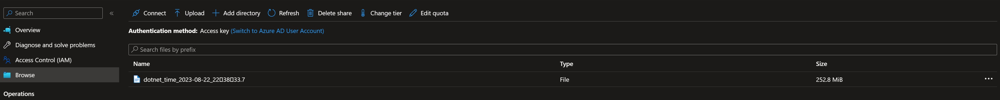

# ProcDump and Cloud Native Applications
In today's distributed and cloud native systems, easy access to diagnostic tools is critical to ensuring the reliability and resilience of applications. Here we'll outline the steps that are needed to leverage ProcDump in a containerized environment.

## **A note on security**
A core dump is a static snapshot of all the memory content of a target process. As such, it can contain critically sensitive data including passwords, social security numbers, credit card numbers, encryption keys, etc. Please make sure you have the right processes in place to uphold the confidentiality and integrity of the sensitive nature of core dumps.

## **Running ProcDump in a container**
The simplest case is running ProcDump from within a container. A few easy steps are all that is required:

1. Make sure to include ProcDump in the container image.
2. Connect to the running container.
3. Run ProcDump.
4. Copy the core dump from the container to a suitable location for postmortem debugging.

## **Running ProcDump in Kubernetes**
Instead of adding ProcDump to all the container images, a more common scenario in Kubernetes is to deploy ProcDump as part of a diagnostics sidecar that can share resources within the pods. Enabling ProcDump to run in a sidecar requires a few additional steps discussed below.

### *Sample Application*
The example YAML snippets in the subsequent sections are based off of a simple .NET Web API that exposes the current weather. Additionally, it also contains a sidecar Ubuntu container with ProcDump included:

```
FROM ubuntu:jammy
RUN apt update
RUN apt install -y wget lsb-release
RUN wget -q https://packages.microsoft.com/config/ubuntu/$(lsb_release -rs)/packages-microsoft-prod.deb -O packages-microsoft-prod.deb
RUN dpkg -i packages-microsoft-prod.deb
RUN apt update
RUN apt install -y procdump
```

The complete YAML file can be found here - [Kubernetes Deployment YAML](deploy.yaml)

### *Share the process namespace*
ProcDump monitors the specified processes and generates core dumps when certain conditions are met. As such, in order for ProcDump to properly run in a sidecar it needs access to the other containers running in the pod where the target application is running. The easiest way to enable process sharing is by adding the below in your Kubernetes deployment YAML:

```
    spec:
      shareProcessNamespace: true
```

For more information on process namespace sharing -  [Share process namespace](https://kubernetes.io/docs/tasks/configure-pod-container/share-process-namespace/)

### *Target process runtime may have additional requirements*
Most of the time, creating core dumps of processes doesn't require anything beyond sharing the process namespace. However, in some situations, there may be additional requirements. For example, when using ProcDump to target .NET applications, it will leverage the .NET runtime to generate more efficient core dumps. ProcDump communicates with the runtime in the target process via a Unix domain socket that is by default mapped in the `/tmp` directory. In order for ProcDump to have access to the `/tmp` directory we need to make sure we mount it properly in our deployment YAML:

```
      volumes:
        - name: tmp
          emptyDir: {}
...
...
...
          volumeMounts:
            - name: tmp
              mountPath: /tmp
```

Once the volume mounts have been defined, ProcDump is now able to communicate with the .NET runtime in the target process. If the creation of *new* volume mounts is not allowed, we can change the default socket directory by setting the `TMPDIR` environment variable to an existing volume mount


### *Use volume mounts to share the core dumps*
When running ProcDump you have to make sure that the directory where the core dump is placed is accessible to the sidecar. This can be done by telling ProcDump to generate the core dump in a volume that is already mounted. For example, in the previous section we mounted the `/tmp` folder and to generate core dumps in the `/tmp` folder we can run the following:

```
procdump <pid> /tmp
```

### *Use Azure Files to share the core dumps*
Granting access to the generated core dumps via a mapped volume typically requires an additional step where the core dump is ultimately transferred to a location where it can be accessed for postmortem debugging. You can eliminate this additional step by using Azure Files as a persistent storage volume. Once mapped, any core dumps that ProcDump writes to that volume will be stored in Azure Files. Azure Kubernetes Service allows you to very easily create dynamic files as shown here - https://learn.microsoft.com/en-us/azure/aks/azure-csi-files-storage-provision.

Below is an example of the YAML that creates the persistent storage in Azure Files:

```
kind: StorageClass
apiVersion: storage.k8s.io/v1
metadata:
  name: <somename>
provisioner: file.csi.azure.com
allowVolumeExpansion: true
mountOptions:
  - dir_mode=0777
  - file_mode=0777
  - uid=0
  - gid=0
  - mfsymlinks
  - cache=strict
  - actimeo=30
parameters:
  skuName: Standard_LRS
---
apiVersion: v1
kind: PersistentVolumeClaim
metadata:
  name: <somename>
spec:
  accessModes:
    - ReadWriteMany
  storageClassName: <somename>
  resources:
    requests:
      storage: 5Gi
---
```

Once the storage above is created, we can use the below volume mounts to get access to it:

```
      volumes:
        - name: data
          persistentVolumeClaim:
            claimName: <somename>

          volumeMounts:
            - name: data
              mountPath: /data
```

Subsequently, anything written to `/data` will be available on Azure Files. For example, if we run ProcDump as below:

```
procdump <pid> /data
```

We can now see the dump appear in Azure Files:


