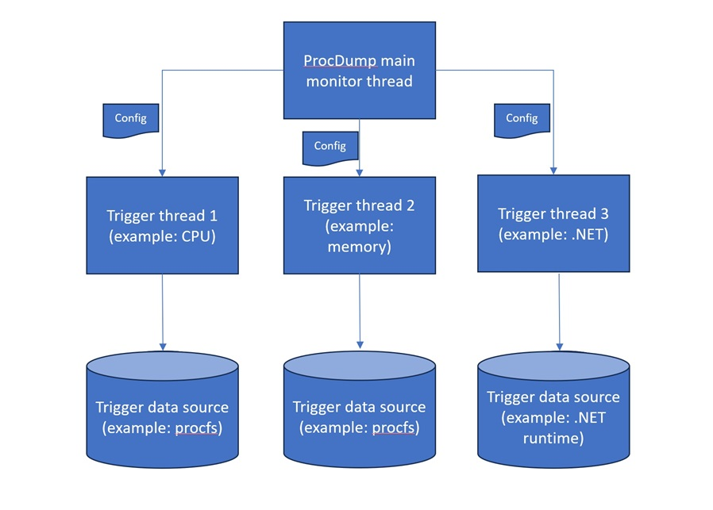

# Implementing a New Trigger in ProcDump
Procdump provides a convenient way for engineers to create core dumps of applications based on triggers. When ProcDump was originally released, it only supported two triggers (CPU and memory) but  as it evolved so did the different type and number of triggers that it currently supports.
This document explains the process of how to add a new trigger to ProcDump. In order to make this as real as possible we will implement a new trigger which allows the user to specify a threshold for the the number of sockets that the application has open before a core dump is generated. This can be very useful if the problematic application is either leaking or using an excessive number of sockets.

## Trigger Architecture
Before we start implementing the new trigger, let's take a look at the important pieces of the ProcDump architecture as it relates to implementing new triggers. Below is a diagram of the architecture that will be discussed.



Generally speaking, ProcDump triggers are all implemented in separate monitoring threads that are all located in [Monitor.c](../src/Monitor.c). For example, the monitoring thread that is responsible for the CPU threshold is called `CpuMonitoringThread`. These monitoring threads are responsible for periodically checking if the current resource usage (for example CPU) has gone above the user specified threshold. Which data source is used to figure out the current resource usage is entirely up to the trigger itself. For example, the memory and CPU triggers use procfs as the data source. As we'll see later on in this document, our new socket trigger will also utilize procfs as its data source.

All configuration options (including the various user specified thresholds) are stored in a `ProcDumpConfiguration` data structure that gets passed to the monitoring thread.

There are two ways by which a monitoring thread can/should exit. First, if the goal of the monitoring thread has been achieved. For example, if the user specified that they wanted 3 dumps when CPU is greater than 95% and all three dumps have been created, the monitoring thread has achieved its goal and should exit. Second, the user can terminate ProcDump using CTRL-C at which time ProcDump should also exit. It's important to note that during a CTRL-C, ProcDump should exit as quickly as possible. Depending on the type of trigger being implemented, it may result in partial core dumps being generated. In order to make it easy for monitoring threads to observe the two terminating scenarios, ProcDump offers helper functions that most monitoring threads use and follow this pattern:

```
    if ((rc = WaitForQuitOrEvent(config, &config->evtStartMonitoring, INFINITE_WAIT)) == WAIT_OBJECT_0 + 1)
    {
        while ((rc = WaitForQuit(config, config->PollingInterval)) == WAIT_TIMEOUT)
        {
            if(<trigger threshold has been reached>)
            {
                Log(info, "Trigger: CPU usage:%d%% on process ID: %d", cpuUsage, config->ProcessId);
                rc = WriteCoreDump(writer);
                if(rc != 0)
                {
                    Trace("Failed to write core dump (%d).", rc);
                    SetQuit(config, 1);
                }

                if ((rc = WaitForQuit(config, config->ThresholdSeconds * 1000)) != WAIT_TIMEOUT)
                {
                    break;
                }
            }
        }
    }
```
The pseudo code above uses helper functions (`WaitForQuitOrEvent` and `WaitForQuit`) that automatically handle the terminating scenarios for you. Under the covers, ProcDump determines when a termination needs to occur and sends a quit event stored in the configuration.

The code snippet above also uses the `Log` and `Trace` helper functions/macros that help tell the user what is occurring as well as provides additional diagnostics that can help troubleshoot ProcDump itself. The `Log` helper should be used when outputting results to stdout that are of interest to the user. In the example above, It outputs a message saying that the CPU trigger has been activated as well as the current CPU usage and target CPU threshold. On the other hand, the `Trace` helper should be used to mark important parts of the code that could be helpful when debugging ProcDump. `Trace` output goes to syslog.

With the architecture above in mind, let's dive into the 4 steps needed to implement the new socket trigger.

## Step 1 - Update Command Line Parsing and Usage Output
Before we can start making code changes, we must first decide on the name of the switch that our new trigger should use. There aren't any hard and fast rules when it comes to naming conventions, but generally speaking, try to use short (2 character) switch names if possible and of course make sure there isn't a naming conflict. ProcDump also supports both the `-` and `/` switch prefixes. In our socket trigger case, we'll use the `-so` switch name.
The command line parsing code that needs to be updated is located in [GetOptions](../src/ProcDumpConfiguration.c) and looks like following:
```
        else if( 0 == strcasecmp( argv[i], "/so" ) ||
                 0 == strcasecmp( argv[i], "-so" ))
        {
            if( i+1 >= argc || self->SocketThreshold != -1 ) return PrintUsage();
            if(!ConvertToInt(argv[i+1], &self->SocketThreshold)) return PrintUsage();
            if(self->SocketThreshold < 0)
            {
                Log(error, "Invalid socket threshold count specified.");
                return PrintUsage();
            }

            i++;
        }
```
The above code make sure we are using the new `so` switch name, parses the specified threshold and stores it into a `ProcDumpConfiguration` data structure member called `SocketThreshold` (please see Step 2 below for information on `ProcDumpConfiguration` considerations).

Next we want to make sure that we also update all the code locations where the ProcDump usage is displayed. First, update [PrintUsage](../src/ProcDumpConfiguration.c) to include the new switch (both short hand as well as longer description):

```
    printf("\nCapture Usage: \n");
    printf("   procdump [-n Count]\n");
    printf("            [-s Seconds]\n");
    ...
    ...
    printf("            [-so Socket_Threshold]\n");
    ...
    ...
    printf("Options:\n");
    printf("   -n      Number of dumps to write before exiting.\n");
    printf("   -s      Consecutive seconds before dump is written (default is 10).\n");
    ...
    ...
    printf("   -so     Socket count threshold above which to create a dump of the process.\n");
    ...
    ...
```
We also need to make the same updates in the [Man page](../procdump.1) and [README](../README.md)

## Step 2 - Update ProcDumpConfiguration
Critical information that needs to be passed between the main ProcDump thread and the monitoring thread are stored in the `ProcDumpConfuguration` data structure. For our socket trigger, that involves storing the threshold that the user specified in order for the monitoring thread to know what to compare against. There are a few different code locations that we need to update. First we update the [Header](../include/ProcDumpConfiguration.h) to include the new threshold:
```
    int SocketThreshold;            // -so
```

Next, we have to update [InitProcDumpConfiguration](../src/ProcDumpConfiguration.c) to set the initial value:
```
    self->SocketThreshold =             -1;
```

We also update the [CopyProcDumpConfiguration](../src/ProcDumpConfiguration.c) to make sure the value gets set properly in cases where the configuration must be copied:
```
    copy->SocketThreshold = self->SocketThreshold;
```

If the data you added to the configuration is dynamically allocated you should also ensure the memory is freed in [FreeProcDumpConfiguration](../src/ProcDumpConfiguration.c).

## Step 3 - Create the New Monitoring Thread
The next step is to create the monitoring thread that will be responsible for monitoring the socket usage.

In [CreateMonitorThreads](../src/Monitor.c) we add the following code:
```
    if (self->SocketThreshold != -1 && !tooManyTriggers)
    {
        if (self->nThreads < MAX_TRIGGERS)
        {
            if ((rc = pthread_create(&self->Threads[self->nThreads].thread, NULL, SocketCountMonitoringThread, (void *)self)) != 0)
            {
                Trace("CreateMonitorThreads: failed to create SocketThread.");
                return rc;
            }

            self->Threads[self->nThreads].trigger = SocketCount;
            self->nThreads++;
        }
        else
        {
            tooManyTriggers = true;
        }
    }
```
The above code checks to see if a socket threshold has been specified and is so creates a new thread with the thread function called `SocketCountMonitoringThread`. It also specifies the trigger type to be `SocketCount` which requires an additional change in [ProfilerCommon](../include/ProfilerCommon.h):
```
enum TriggerType
{
    Processor,
    ...
    SocketCount,
    ...
};
```

## Step 4 - Implement the New Monitoring Thread
The last step is actually implementing the code behind our new socket trigger. We start by adding the new trigger function to [Monitor.h](../include/Monitor.h):
```
void *SocketCountMonitoringThread(void *thread_args /* struct ProcDumpConfiguration* */);
```

Next we add the boiler plate code for the function in [Monitor.c](../src/Monitor.c) explained in the "Trigger Architecture" section earlier in this document:
```
//--------------------------------------------------------------------
//
// SocketCountMonitoringThread - Thread monitoring for socket count
//
//--------------------------------------------------------------------
void* SocketCountMonitoringThread(void *thread_args /* struct ProcDumpConfiguration* */)
{
    Trace("SocketCountMonitoringThread: Enter [id=%d]", gettid());
    struct ProcDumpConfiguration *config = (struct ProcDumpConfiguration *)thread_args;

    struct ProcessStat proc = {0};
    int rc = 0;
    auto_free struct CoreDumpWriter *writer = NULL;

    writer = NewCoreDumpWriter(FILEDESC, config);

    if ((rc = WaitForQuitOrEvent(config, &config->evtStartMonitoring, INFINITE_WAIT)) == WAIT_OBJECT_0 + 1)
    {
        while ((rc = WaitForQuit(config, config->PollingInterval)) == WAIT_TIMEOUT)
        {
            // Check for sockets count and generate core dump if threshold has been reached
        }
    }

    Trace("SocketCountMonitoringThread: Exit [id=%d]", gettid());
    return NULL;
}
```
In order to get the current socket count for the given process we define a helper function called `GetSocketCount`. We won't dive into the details of how this function is implemented as it's outside the scope of this document, but the general approach is to enumerate all file descriptors for the process (using procfs as the data source) and check which ones are socket based. The total count is then compared to the user specified threshold. Our socket monitoring thread now looks like (replacing the "Check for sockets count" comment above):

```
        ...
        ...
        while ((rc = WaitForQuit(config, config->PollingInterval)) == WAIT_TIMEOUT)
        {
            int socketCount = GetCurrentSocketCount(config->ProcessId);
            if (socketCount >= config->SocketThreshold)
            {
                Log(info, "Trigger: Sockets:%d on process ID: %d", socketCount, config->ProcessId);
                rc = WriteCoreDump(writer);
                if(rc != 0)
                {
                    SetQuit(config, 1);
                }

                if ((rc = WaitForQuit(config, config->ThresholdSeconds * 1000)) != WAIT_TIMEOUT)
                {
                    break;
                }
            }
        }
        ...
        ...
```
Please note that since we are using the `WaitForQuit` helper function, it automatically takes care of the termination scenarios.